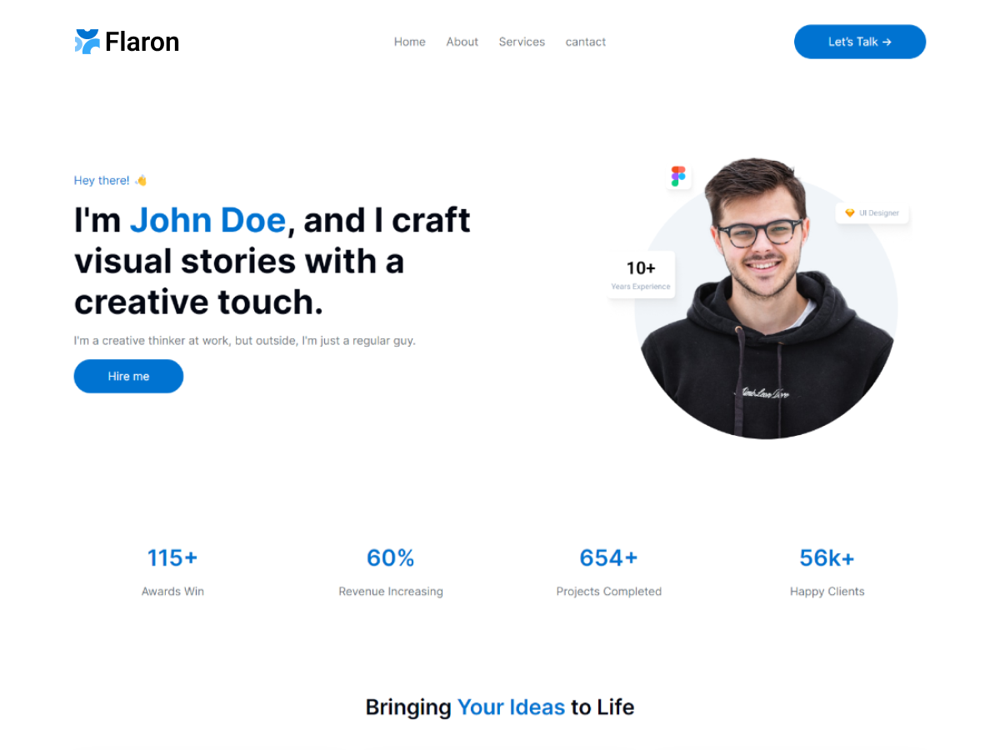

# Flaron

Flaron, A modern WordPress block theme with 30+ block patterns and two landing pages. No coding required.

## About

Flaron is a modern WordPress block theme that empowers you to create stunning websites. With over 30 pre-designed block patterns and 2 landing pages (portfolio & marketing agency), Built for the future of WordPress, Flaron integrates seamlessly with the powerful new block editor, giving you complete control over your website's design and layout – no coding required.

## Key Features

- Fully Block-Based: Leverage the power of WordPress Blocks to build flexible and dynamic layouts for your website.
- 30+ Built-in Patterns: Get started quickly with a vast collection of pre-designed block layouts covering common website sections like headers, features, portfolios, testimonials, and more.
- Dual Landing Pages: Choose from two pre-built landing pages - one designed specifically for portfolios and another for marketing digital agencies. Customize them to fit your unique needs.
- Highly Customizable: Tailor Flaron to your unique brand with a variety of theme options and block styles.
- Responsive Design: Flaron ensures your website looks flawless across all devices, from desktops to mobile phones.
- Lightweight & Fast Loading: Enjoy a smooth user experience with Flaron's optimized code for fast loading times.

## Who is Flaron for?

Flaron is perfect for:

- Freelancers and creatives looking to showcase their work in a stylish portfolio.
- Marketing agencies and digital businesses wanting to make a strong first impression.
- Anyone who wants a beautiful, easy-to-use website built with WordPress.

## Requirements

- WordPress 6.0+
- PHP 7.0+

## Copyright

Copyright © 2023, Flaron.
Flaron is distributed under the terms of the GNU GPL.

This program is free software; you can redistribute it and/or
modify it under the terms of the GNU General Public License
as published by the Free Software Foundation; either version 2
of the License, or (at your option) any later version.

This program is distributed in the hope that it will be useful,
but WITHOUT ANY WARRANTY; without even the implied warranty of
MERCHANTABILITY or FITNESS FOR A PARTICULAR PURPOSE. See the
GNU General Public License for more details.

## Resources

### Fonts

- **Inter font**

  - License: (c) 2016 Rasmus, SIL
  - License URL: [Inter License](https://github.com/rsms/inter/blob/master/LICENSE.txt)

- **Bricolage Grotesque font**

  - License: SIL Open Font License, Version 1.1
  - License URL: [Bricolage Grotesque License](https://openfontlicense.org/open-font-license-official-text/)

### Images

#### Logos

- License: Fair Use License
- License URL: [Logos License](https://logoipsum.com/license/)
- Logo-1.png: [Link](https://logoipsum.com/artwork/259)
- Logo-2.png: [Link](https://logoipsum.com/artwork/261)
- Logo-3.png: [Link](https://logoipsum.com/artwork/242)
- Logo-4.png: [Link](https://logoipsum.com/artwork/212)
- Logo-5.png: [Link](https://logoipsum.com/artwork/220)
- Logo-6.png: [Link](https://logoipsum.com/artwork/235)

#### Custom Icons and Graphics

- All images in /assets/images/icons created by Qara Yahya and available via CC0.
- flaron-notice-welcome.png, hero-business.png, hero-portfolio.png, placeholder-simple.png - created by Qara Yahya and available via CC0.
- License URL: [CC0 1.0 License](https://creativecommons.org/publicdomain/zero/1.0/)

#### Other Images

- License: Unsplash License
- License URL: [Unsplash License](https://unsplash.com/license)
- Edited by: Qara Yahya, originally downloaded from [Unsplash](Unsplash.com)
- Files: user-1.png, user-2.png, user-3.png, user-4.png, user-5.png, user-6.png, co-workers.png, placeholder.png, placeholder-vertical.png, hero-portfolio-large.png
